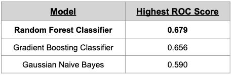

# Fake News, Real Lies

The question I wanted to answer with this project is: can we identify a lie given the words a politican uses? To try to answer this, I used IEEE's Fake News dataset to build and compare different models trained with Natural Language Processing techniques. I used area under the ROC curve to score my models and choose the best one: a Random Forest Classifier with no stopwords, no stemmer or lemmatizer, no limits on features (words), and no ngrams. 

## Exploring The Data

The data in IEEE's Fake News dataset consisted of over 17,000 rows of political statements that were labeled as either 'Real' or 'Fake.' This dataset spanned from 2007-2020, had over 4,000 unique speakers, and was labeled almost 50% 'Real' and 50% 'Fake.' The average number of words per statement was 18.

The dataset can be found [here](https://ieee-dataport.org/open-access/fnid-fake-news-inference-dataset).

The bar chart below shows the number of 'Real' and 'Fake' statements made every year (on the left) and by month (on the right). Since this data is 50% 'Real' and 50% 'Fake,' it may not be representative of the population of political statements, but this data does suggest the number of 'Real' statements have decreased in the last few years. The statements made by month do not show any big surprises. This chart suggests statements may decrease a little around the holidays (Novemeber and December) with an increase in October just before elections in early November.

The 17,000+ statements in this data have over 4,000 unique speakers. Howerver, the top 20 speakers make up nearly a third of the data. Below you can see a list of the top 20 speakers, the number of statements they have made, the number of 'Fake' statements they have made, the % of 'Fake' statements they have made, and the political party they are associated with if applicable. 

The highlighted rows show speakers with more than 50% 'Fake' statements. Most people do not lie more than 50% of the time, with the exception of Donald Trump and Ted Cruz. The other rows with over 50% lies are actually from sources like Facebook posts and blogs. 

To answer the question if words used in a statement can indicate if that statement is 'Real' or not, we need to know which words are used in 'Real' statements and which are used in 'Fake' ones. Below are two word clouds. On the left are words commonly used in 'Fake' statements, and on the right are words commonly used in 'Real' statements. 

Looking at these word clouds, it seems 'president' and 'Obama' are used more often in 'Fake' statements than 'Real' ones, and there is some evidence numbers may be used more in 'Real' statements than 'Fake' ones- as seen by the word 'percent' and the '000.' But overall there is a fair amount of overlap between these two word clouds (all 4 words are used in both clouds). This suggests that any difference between these groups that a model could pick up probably will not be due to topic.

## Modeling

To prep for modeling, I split my data into a train (80%) and test set so that I would have some data to test my winning model on that it had not seen before. I decided to use the area under the ROC curve to score my models as I wanted to reward models with a high true positve rate and low false positive rates. (If you are a news organization, you want to make sure you can identify fake news but you do not want to accuse a politician of being a liar if they are not.) I also decided to score my models using 5 Kfolds and average the resulting ROC curve scores.

I choose to compare three types of models: Random Forest Classifiers, Graident Boosting Classifiers, and Gaussian Naive Bayes Classifiers. When deciding what features to use, I considered: stop words, no stopwords, Snowball stemmer, Word Net Lemmatizer, no stemmer or lemmatizer, a 5000 word limit on number of features, no limit on number of features, n-grams up to 3, no n-grams. 

The highest resulting AUC ROC scores for the three model types were:

My winning model was a Random Forest Classifier with no stopwords, no stemmer or lemmatizer, no limit on number of features, and no n-grams (n-grams produced a very slightly better model- still rounded to 0.679 and took way longer so I decided the benefit was not worth it). No stop words or stemmers or lemmatizers may be surprising, but as we saw earlier with the word clouds, subtly matters. The tense of verbs, the number of specific stop words etc. may be the difference between 'Real' and 'Fake' statements not the topic of the statement.

Finally I tested my winning model using the test set data I had set aside earlier and got a slightly higher AUC ROC score. This suggests that my model is not over-fitted.

## Next Steps

I would like to have done a grid search to refine my models. 
I want to graph the ROC curves of my models to compare their shapes.
I would like to do a little feature importance and figure out what words help indicate a lie.
And I think it would be worth separating democrats and republicans to see if there are differences in how they lie and about what.
Also may be worth taking out non-people speakers.

